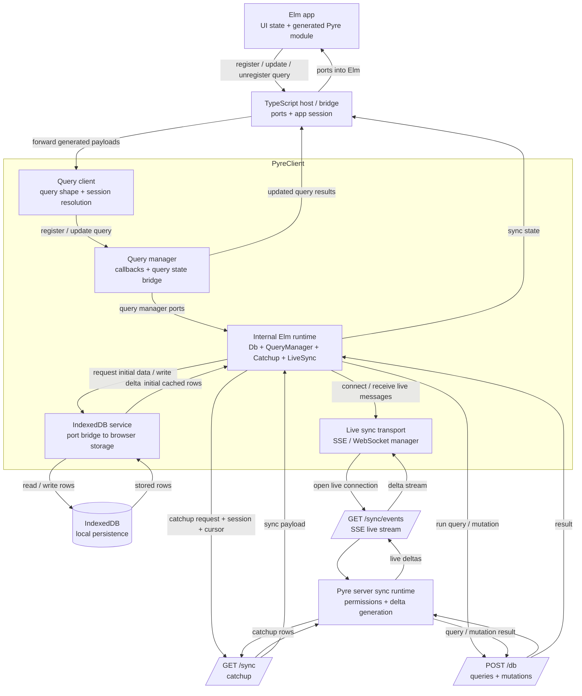

# Sync Setup

This setup is for applications that:

- run a Pyre-backed server
- want live sync on the client
- want generated Elm query code to work with `@pyre/client`

Pyre generates:

- server-side TypeScript for executing queries and mutations
- generated Elm query modules for client consumption
- shared TypeScript metadata and query shapes

## 1. Define schema and queries

Create `pyre/schema.pyre` and `pyre/query.pyre`:

```pyre
session {
    userId Int
}

record User {
    @public

    id Int @id
    ownerId Int
    name String
}

query GetUser($id: Int) {
    user {
        @where { id == $id && ownerId == Session.userId }

        id
        name
    }
}
```

## 2. Migrate the database

```bash
touch db/app.db
pyre migrate db/app.db
```

## 3. Generate code

```bash
pyre generate
```

Generated output includes:

```text
pyre/generated/
├── client/
│   └── elm/
│       ├── Pyre.elm
│       └── Query/
├── typescript/
│   ├── core/
│   ├── server.ts
│   └── run.ts
```

## 4. Server usage

Use the generated server target to run queries against your database:

```typescript
import * as Query from './pyre/generated/typescript/server';

const env = {
  url: 'file:./db/app.db',
  authToken: undefined,
};

const session = { userId: 1 };

const result = await Query.run(env, 'GetUser', session, { id: 1 });

if (result.kind === 'success') {
  console.log(result.data);
} else {
  console.error(result.message);
}
```

## 5. `PyreClient` setup

`PyreClient` boots the internal Elm sync engine, manages IndexedDB, and keeps live queries up to date.

## Sync data flow



Information moves through the system in three main paths:

- Startup: `PyreClient` restores cached state from IndexedDB, then performs server catchup.
- Live sync: the server pushes deltas over `/sync/events`, and `PyreClient` applies and persists them.
- Query/mutation flow: Elm emits generated payloads, the TS host forwards them to `PyreClient`, mutations go to the server, and results come back into Elm through ports.

```typescript
import { PyreClient } from '@pyre/client';
import { schemaMetadata } from './pyre/generated/typescript/core/schema';

const client = new PyreClient({
  schema: schemaMetadata,
  server: {
    baseUrl: 'http://localhost:3000',
    endpoints: {
      catchup: '/sync',
      events: '/sync/events',
      query: '/db',
    },
  },
  session: {
    userId: 1,
  },
});

await client.init();
```

If your session values change later, update them and refresh active queries:

```typescript
client.setSession({ userId: 2 });
```

## 6. Elm app setup

Your app owns the generated `Pyre.Model` and routes generated effects through ports.

Typical model shape:

```elm
type alias Model =
    { pyre : Pyre.Model
    }
```

Initialize it with:

```elm
init : flags -> ( Model, Cmd Msg )
init _ =
    ( { pyre = Pyre.init }
    , Cmd.none
    )
```

Use generated queries through `Pyre.QueryUpdate`:

```elm
type Msg
    = PyreMsg Pyre.Msg
    | PyreEffectHandled Encode.Value


update : Msg -> Model -> ( Model, Cmd Msg )
update msg model =
    case msg of
        PyreMsg pyreMsg ->
            let
                ( newPyre, effect ) =
                    Pyre.update pyreMsg model.pyre
            in
            ( { model | pyre = newPyre }
            , handlePyreEffect effect
            )

        PyreEffectHandled _ ->
            ( model, Cmd.none )


handlePyreEffect : Pyre.Effect -> Cmd Msg
handlePyreEffect effect =
    case effect of
        Pyre.NoEffect ->
            Cmd.none

        Pyre.Send payload ->
            sendPyreMessage payload

        Pyre.LogError payload ->
            logPyreError payload
```

Register or update a query with:

```elm
PyreMsg
    (Pyre.QueryUpdate
        (Pyre.GetUser "user-1" { id = 1 })
    )
```

Read the current result with:

```elm
Pyre.getResult "user-1" model.pyre.getUser
```

## 7. Port wiring between Elm and `PyreClient`

The generated `Pyre.elm` module sends JSON payloads that include:

- `queryName`
- `querySource`
- `queryInput`
- `queryId`

Generated Elm mutation modules send JSON payloads that include:

- `requestId`
- `mutationId`
- `mutationName`
- `mutationInput`

`querySource` is the generated query shape. It includes selected fields and query directives, including `@where`.

For `@where`, generated query shapes preserve placeholders:

- query input placeholders: `{"$var":"id"}`
- session placeholders: `{"$session":"userId"}`

`PyreClient` resolves those placeholders before registering or re-running the query internally.

The intended flow is:

1. Elm emits `Pyre.Send payload`
2. Your JS/TS host forwards that payload to `PyreClient`
3. `PyreClient` executes or updates the query
4. Results are sent back into Elm with `queryName` for decoder routing
5. Elm decodes them with `Pyre.decodeIncomingDelta`

For mutations, the flow is:

1. Elm sends a generated `Query.SomeMutation.mutationRequest requestId input` payload
2. Your JS/TS host forwards that payload to `PyreClient`
3. `PyreClient` POSTs the mutation to the server using `mutationId`
4. `PyreClient` forwards the immediate mutation result back into Elm with the same `requestId`
5. The actual read model change arrives later through sync

## 8. Notes

- The generated Elm query modules now expose `queryShape`.
- Generated Elm mutation modules expose `id`, `name`, `mutationRequest`, and `decodeMutationResult`.
- `Pyre.elm` uses those generated `queryShape` values automatically.
- `@where`, `@sort`, and `@limit` are preserved in generated query shapes.
- Session-aware filters require keeping `PyreClient` session state current via `setSession`.
