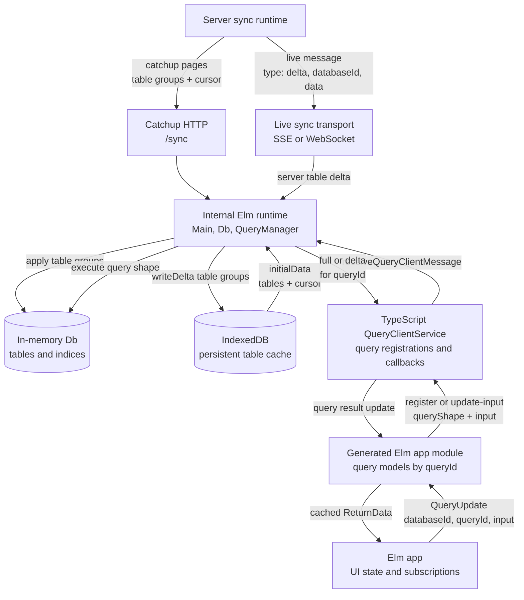
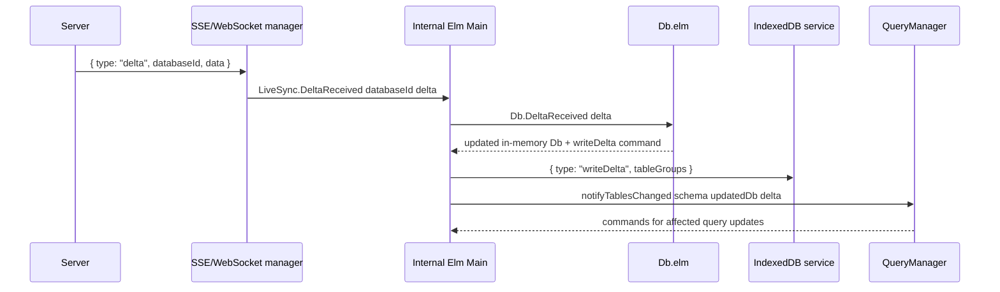
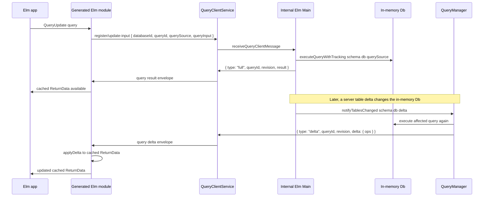

# Client Data Flow

This document describes how information moves through the Pyre client runtime and generated Elm application code. The key distinction is that Pyre uses two different delta shapes at two different boundaries:

- **Server table deltas** describe changed rows grouped by source table.
- **Query result deltas** describe edits to one registered query result.

## Overview



## Runtime Layers

| Layer | Main code | Owns | Information shape |
| --- | --- | --- | --- |
| Live sync transport | `src-ts/service/sse.ts`, `src-ts/service/websocket.ts`, `Data.LiveSync.elm` | Connection to `/sync/events` | Live messages with `type`, optional `databaseId`, and `data` |
| IndexedDB bridge | `src-ts/service/indexeddb.ts`, `Data.IndexedDb.elm` | Browser persistence | Initial tables, sync cursor, and written table groups |
| In-memory database | `Db.elm`, `Db.Index.elm` | Current table rows and indices | `Dict tableName (Dict id row)` plus indices |
| Query shape executor | `Db.Query.elm`, `Db.elm` | Running query shapes against memory | Decoded query shape, selected result rows, tracked row IDs |
| Query manager | `Data.QueryManager.elm` | Active runtime subscriptions | `queryId`, query shape, input, last result, revision |
| TypeScript query client | `src-ts/service/query-client.ts` | Host callbacks and TS-facing query state | `full` or `delta` envelopes by `queryId` |
| Generated Elm app layer | generated by `src/generate/client/elm.rs` | App-facing typed query models | `QueryModel input result` with cached `ReturnData` |

## Server Table Delta Flow

Server table deltas update the local database. They are not query-specific.



The live-sync table delta payload is organized around source tables. On the wire, `data` is this list of table groups:

```ts
type ServerTableDelta = Array<{
  table_name: string
  headers: string[]
  rows: unknown[][]
}>
```

Elm decodes that into `Data.Delta.Delta`, where `table_name` becomes `tableName`. The IndexedDB bridge persists the same table-group information after the in-memory `Db` has applied it, wrapped in a port message:

```ts
type WriteDeltaMessage = {
  type: "writeDelta"
  tableGroups: ServerTableDelta
}
```

IndexedDB also supplies startup state back to Elm:

```ts
type InitialData = {
  tables: Record<string, Array<Record<string, unknown>>>
  cursor: {
    tables: Record<string, {
      last_seen_updated_at: number | null
      permission_hash: string
    }>
  }
}
```

## Query Result Flow

Query result deltas are produced after the local query manager decides that a server table delta affects a registered query. They are scoped to one `queryId`.



A generated query registration carries a concrete query shape and input:

```ts
type QueryRegistration = {
  type: "register" | "update-input"
  databaseId: string
  queryId: string
  queryName?: string
  querySource: QueryShape
  queryInput: unknown
}
```

The first result for a query is usually a full result:

```ts
type QueryFullEnvelope = {
  type: "full"
  queryId: string
  revision: number
  result: Record<string, Array<Record<string, unknown>>>
}
```

Later updates can be sent as query-result delta ops:

```ts
type QueryDeltaEnvelope = {
  type: "delta"
  queryId: string
  revision: number
  delta: {
    ops: Array<
      | { op: "set-row"; path: string; row: Record<string, unknown> }
      | { op: "remove-row"; path: string }
      | { op: "insert-row"; path: string; index: number; row: Record<string, unknown> }
      | { op: "move-row"; path: string; from: number; to: number }
      | { op: "remove-row-by-index"; path: string; index: number }
    >
  }
}
```

Query delta paths point into the query result, not into IndexedDB. For example, `.users[0]` or `.users#(10).posts[1]` identifies a location in a cached result tree.

## Generated Elm Cache

Generated Elm code keeps an app-facing cache per live query. The generated model shape is:

```elm
type alias QueryModel input result =
    { input : input
    , result : result
    , revision : Int
    }
```

For each generated query, the app sends `QueryUpdate`. The generated module serializes the typed database ID, query ID, query shape, and encoded input through ports. When a `full` or `delta` envelope returns, generated query-specific code decodes it and updates the cached `ReturnData`.

## Practical Mental Model

1. IndexedDB is persistence for table rows and sync cursors. It does not decide which app queries changed.
2. The internal Elm runtime owns the in-memory table cache and local query execution.
3. `Data.QueryManager` converts table-level changes into query-specific `full` or `delta` result updates.
4. Generated Elm code owns typed app-facing query state, including the cached result for each `queryId`.
5. A server delta says "these table rows changed"; a query delta says "this query result changed at this path".

See [`TABLE_ENTITY_STREAM.md`](TABLE_ENTITY_STREAM.md) for a proposed second consumption mode that exposes table/entity changes directly to app runtimes that do their own derivation.
