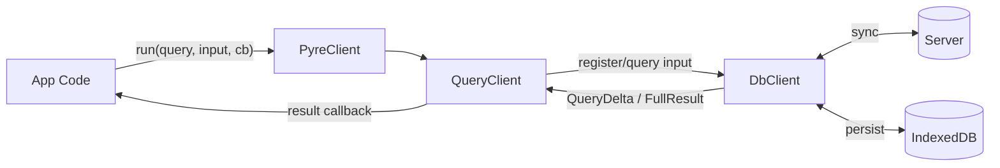

# Query Delta Contract

This document defines the private contract between the DbClient and QueryClient. It keeps the external interface stable while enabling incremental updates to query results.

## Flow



The application-facing API remains unchanged. This is a private internal split between DbClient and QueryClient.

## External API (Unchanged)

```ts
const pyreClient = new PyreClient({
  schema: schemaMetadata,
  server: {
    baseUrl: "http://localhost:3000",
    liveSyncTransport,
    endpoints: {
      catchup: `/sync?${queryParams}`,
      events: `/sync/events?${queryParams}`,
      query: `/db?${queryParams}`,
    },
  },
  indexedDbName,
})
```

```ts
// Query for all users and all posts
// The query will run immediately (may return empty), then re-run when sync completes
const unsubscribe = client.pyreClient.run(
  ListUsersAndPosts,
  {},
  (result) => {
    const userId = client.userId || client.requestedUserId || 0
    const user = result.user?.find((u: any) => u.id === userId) || null

    const posts = result.post || []

    setData({ user, posts })
  }
)
```

## QueryDelta Envelope

Every update sent from DbClient to QueryClient is either a full replacement or a delta.

```json
{
  "type": "full",
  "queryId": "q123",
  "revision": 12,
  "result": { "post": { "id": 10, "title": "Hello" } }
}
```

```json
{
  "type": "delta",
  "queryId": "q123",
  "revision": 13,
  "delta": {
    "ops": [
      {
        "op": "set-row",
        "path": ".post",
        "row": { "id": 10, "title": "Hello, world" }
      }
    ]
  }
}
```

Notes:
- `queryId` identifies a registered query.
- `revision` is a monotonically increasing number per query. QueryClient applies deltas in order, without requesting retries.

DbClient can always choose to send a `full` replacement instead of a delta.

## Query Registration (QueryClient -> DbClient)

QueryClient owns registration and input changes. It forwards the data needed for execution, and DbClient responds with full results or deltas.

```json
{
  "type": "register",
  "queryId": "q123",
  "querySource": "GetPost",
  "queryInput": { "id": 10 }
}
```

```json
{
  "type": "update-input",
  "queryId": "q123",
  "queryInput": { "id": 11 }
}
```

## Path Format (Dot Notation)

Paths target rows, not scalar fields. A path resolves to either:
- A row object in the query result, or
- A list container of rows (for list operations)

Paths are dot-separated segments and always start with `.`.

Segment types:
- Field segment: the output field name in the query result (aliases, not source field names)
- Row selector segment: either an index or an id selector

Row selectors:
- Index: `[0]`, `[1]`, `[2]`, ... (zero-based)
- Id selector: `#(<id>)` (recommended for stability)

Examples:
- `.user` (single row result at root)
- `.post[0]` (first post)
- `.post#(10)` (post with id 10)
- `.post#(user-123)` (post with id user-123)
- `.post#(10).author` (author row of a post)
- `.user#(3).posts[2]` (third post nested under user 3)

Because paths target rows, field-level changes are represented by replacing the entire row at that path.

## Path Resolution Rules

- Paths are evaluated against the current query result shape.
- Field segments use the output field name (including aliases).
- A row selector applies to the list at the immediately preceding field segment.
- `#(<id>)` matches the row whose `id` equals the provided string or integer.
- `[index]` selects the row at that zero-based index.
- If any segment cannot be resolved (missing field, non-list where list expected, id not found, index out of bounds), QueryClient logs the failure and skips the op.

## Selector Parsing

- Id selectors use `#(<id>)` where `<id>` is the full id string.
- `<id>` supports classic escaping with backslash: `\` for backslash and `\)` for a literal `)`.
- Parsing should unescape `\)` to `)` and `\\` to `\`.

## QueryDelta Ops

All operations apply to the stored query result in QueryClient. QueryClient does not interpret schema, only paths.

### set-row
Replaces or inserts a full row object at a path that resolves to a row.

```json
{ "op": "set-row", "path": ".post#(10)", "row": { "id": 10, "title": "Updated" } }
```

### remove-row
Removes a row at a path that resolves to a row.

```json
{ "op": "remove-row", "path": ".post#(10)" }
```

### insert-row
Inserts a row into a list path at a specific index.

```json
{ "op": "insert-row", "path": ".post", "index": 2, "row": { "id": 12, "title": "New" } }
```

### move-row
Moves a row within a list path.

```json
{ "op": "move-row", "path": ".post", "from": 5, "to": 1 }
```

### remove-row-by-index
Removes a row at a list path by index.

```json
{ "op": "remove-row-by-index", "path": ".post", "index": 0 }
```

## QueryClient Responsibilities

- Maintain a registry of query results keyed by `queryId`.
- Store `querySource` and `queryInput` for each query.
- Forward query registration and input changes to DbClient.
- Apply `QueryDelta` ops in order, producing a new result that preserves structural sharing.
- Treat any input change as requiring a full result (DbClient will send one).
- If an op cannot be applied (missing path, invalid index, missing id), log the failure and skip the op.

## DbClient Responsibilities

- Receive query registrations and input changes from QueryClient.
- Execute queries and decide between `full` and `delta` updates.
- Translate data changes into QueryDelta ops, including nested rows.
- Ensure paths resolve to rows or list containers in the query result shape.
- Increment `revision` for each update per query.

## Nested Queries

Nested results are updated by addressing the nested row path and replacing that row. For example, to update the author of post 10:

```json
{
  "op": "set-row",
  "path": ".post#(10).author",
  "row": { "id": 3, "name": "Ada" }
}
```

If a nested list changes (e.g., comments), use list operations at the list path:

```json
{ "op": "insert-row", "path": ".post#(10).comments", "index": 0, "row": { "id": 99, "body": "Hi" } }
```

## Summary

- QueryClient is a pure patch-applier for query results.
- DbClient owns correctness and chooses between `full` and `delta`.
- Paths are dot-based and resolve to rows or lists, never scalar fields.
- The public PyreClient API stays the same.

## Elm Generated QueryClient Sketch

The generated Elm module owns query registration and delta application. It forwards registration and input changes to DbClient and logs patch failures via a JS port.

### Module Shape

- `port module Pyre exposing (Model, Msg, init, update, subscriptions)`
- One outgoing port for register/input updates
- One incoming port for QueryDelta payloads
- One outgoing port for logging failures

Incoming delta payloads are decoded into query-specific delta types. Delta application code is generated per query, rather than using a generic runtime abstraction.

### Model Shape (Generated)

Each query has a field on the model. Each field stores a `Dict QueryId SpecificQueryModel`.

```elm
type alias Model =
    { listUsersAndPosts : Dict String ListUsersAndPostsModel
    , getPost : Dict String GetPostModel
    }

type alias ListUsersAndPostsModel =
    { input : Query.ListUsersAndPosts.Input
    , result : Query.ListUsersAndPosts.ReturnData
    , revision : Int
    }
```

`SpecificQueryModel` should include whatever a query needs to apply deltas and report results (input, current result, revision, and optional status flags).

### Id Assignment

Query registration requires a `QueryId` provided by the caller. This keeps the generated Elm API simple and avoids internal id generation.

### Registration Flow (Caller-Provided QueryId)

Registering a query requires a `QueryId` from the caller. The same id is used for updates and unsubscribe.

```elm
type Msg
    = ListUsersAndPosts_Registered String Query.ListUsersAndPosts.Input
    | ListUsersAndPosts_InputUpdated String Query.ListUsersAndPosts.Input
    | ListUsersAndPosts_DataReceived Query.ListUsersAndPosts.QueryDelta

update msg model =
    case msg of
        ListUsersAndPosts_Registered queryId input ->
            ( model
            , pyre_sendQueryClientMessage
                (encodeRegister "ListUsersAndPosts" queryId input)
            )

        ListUsersAndPosts_InputUpdated queryId input ->
            ( model, pyre_sendQueryClientMessage (encodeUpdateInput queryId input) )

        ListUsersAndPosts_DataReceived _ ->
            ( model, Cmd.none )
```

The `QueryId` is caller-owned, so no registration ack is required for id assignment.

### Ports (Sketch)

```elm
port pyre_sendQueryClientMessage : Encode.Value -> Cmd msg

port pyre_receiveQueryDelta : (Decode.Value -> msg) -> Sub msg

port pyre_logQueryDeltaError : Encode.Value -> Cmd msg
```

### Messages (Sketch)

```elm
type Msg
    = ListUsersAndPosts_Registered String Query.ListUsersAndPosts.Input
    | ListUsersAndPosts_InputUpdated String Query.ListUsersAndPosts.Input
    | ListUsersAndPosts_DataReceived Query.ListUsersAndPosts.QueryDelta
```

### Responsibilities

- Accept QueryId from the caller on register and forward to DbClient.
- Store `SpecificQueryModel` per QueryId.
- Apply `QueryDelta` ops to the stored result.
- On failure to apply an op, send a log message through the logging port and skip the op.

### Error Logging Payload

Log messages are structured JSON with a human-readable `message` and enough context to debug the failed op.

```json
{
  "message": "QueryDelta op failed: id not found",
  "queryId": "q123",
  "op": "set-row",
  "path": ".post#(10)",
  "details": "No row with id=10 in list 'post'"
}
```
