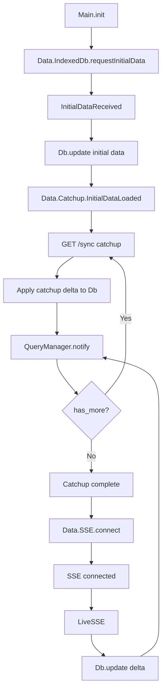

# Sync Behavior

## Startup sequence

1. **Elm init (`Main.elm`)**
   - `Main.init` starts the headless worker with flags (`schema`, `server`).
   - It immediately sends `IndexedDb.requestInitialData` (via `Data.IndexedDb`).

2. **IndexedDB bootstrap (`Data.IndexedDb` + `Db`)**
   - The TS IndexedDB service returns `InitialDataReceived`.
   - `Main.handleIndexedDbIncoming` updates the in-memory `Db` and re-runs all registered queries.
   - `Data.Catchup` receives `InitialDataLoaded` and computes the initial sync cursor from the in-memory DB.

3. **Catchup loop (`Data.Catchup`)**
   - Once initial data is loaded, `Data.Catchup` requests `/sync`.
   - Each catchup response is converted to a delta and applied to the in-memory `Db`.
   - `Data.QueryManager` is notified so queries re-run.
   - The cursor is updated in memory and the loop continues until `has_more = false`.

4. **SSE handshake (`Data.SSE`)**
   - After catchup completes, `Main.elm` opens the SSE connection.
   - The server emits `connected` when the stream is live.

5. **Live updates (SSE deltas)**
   - `Data.SSE` delivers delta messages to `Main.handleSSEIncoming`.
   - Deltas are applied to `Db`, and `Data.QueryManager` re-runs affected queries.

## Flow diagram

## Key ordering guarantees

- Catchup starts immediately after `InitialDataLoaded`.
- SSE does not connect until catchup finishes.
- Query re-execution happens:
  - after IndexedDB bootstraps, and
  - after each catchup page, and
  - after each SSE delta.
