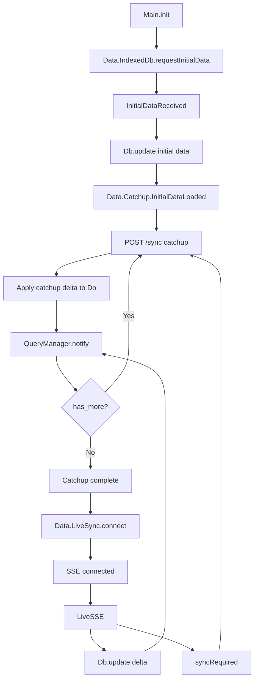

# Sync Behavior

## Startup sequence

1. **Elm init (`Main.elm`)**
   - `Main.init` starts the headless worker with flags (`schema`, `server`).
   - It immediately sends `IndexedDb.requestInitialData` (via `Data.IndexedDb`).

2. **IndexedDB bootstrap (`Data.IndexedDb` + `Db`)**
   - The TS IndexedDB service returns `InitialDataReceived`.
   - `Main.handleIndexedDbIncoming` updates the in-memory `Db` and re-runs all registered queries.
   - `Data.Catchup` receives `InitialDataLoaded` and computes the initial sync cursor from the in-memory DB.

3. **Catchup loop (`Data.Catchup`)**
   - Once initial data is loaded, `Data.Catchup` requests `/sync`.
   - Each catchup response is converted to a delta and applied to the in-memory `Db`.
   - `Data.QueryManager` is notified so queries re-run.
   - The cursor is updated in memory and the loop continues until `has_more = false`.

4. **SSE handshake (`Data.LiveSync`)**
   - After catchup completes, `Main.elm` opens the SSE connection.
   - The server emits `connected` when the stream is live.

5. **Live updates (SSE deltas)**
    - `Data.LiveSync` delivers delta messages to `Main.handleLiveSyncIncoming`.
    - Deltas are applied to `Db`, and `Data.QueryManager` re-runs affected queries.
    - If the server sends `syncRequired` or `catchupRequired`, the client starts a POST catchup from its current cursor instead of applying a live delta.

## Flow diagram

```mermaid
flowchart TD
    MainInit[Main.init] --> IndexedDbReq[Data.IndexedDb.requestInitialData]
    IndexedDbReq --> IndexedDbReply[InitialDataReceived]
    IndexedDbReply --> DbInit[Db.update initial data]
    DbInit --> CatchupInit[Data.Catchup.InitialDataLoaded]

    CatchupInit --> CatchupFetch[POST /sync catchup]
    CatchupFetch --> CatchupDelta[Apply catchup delta to Db]
    CatchupDelta --> QueryNotify[QueryManager.notify]
    QueryNotify --> HasMore{has_more?}
    HasMore -->|Yes| CatchupFetch
    HasMore -->|No| CatchupDone[Catchup complete]

    CatchupDone --> SSEConnect[Data.LiveSync.connect]
    SSEConnect --> SSEConnected[SSE connected]
    SSEConnected --> LiveSSE

    LiveSSE --> DbDelta[Db.update delta]
    DbDelta --> QueryNotify
    LiveSSE --> SyncRequired[syncRequired]
    SyncRequired --> CatchupFetch
```

## Key ordering guarantees

- Catchup starts immediately after `InitialDataLoaded`.
- SSE does not connect until catchup finishes.
- Query re-execution happens:
   - after IndexedDB bootstraps, and
   - after each catchup page, and
   - after each SSE delta.
- Authoritative catchup/live deltas are applied before local optimistic mutations are replayed.
- Live sync deltas with `serverRevision <= lastAppliedServerRevision` are stale and are skipped.
- The client persists `lastAppliedServerRevision` in IndexedDB metadata and restores it at startup.
- Live `syncRequired` / `catchupRequired` messages with stale `serverRevision` values are ignored.
- Catchup responses include the current `serverRevision` when the server has allocated one, so reconnect catchup advances the same revision watermark as live sync.

## Mutation Ordering

Pyre treats mutation request order, response order, and live-sync arrival order as separate concerns.

- The client assigns each mutation a stable `requestId`.
- The server response acknowledges that `requestId` and returns the normal mutation result.
- The client keeps in-flight optimistic mutations in request order until the server response accepts or rejects them.
- Authoritative live/catchup data is applied to the local DB first, then unsettled optimistic mutations are replayed over it.
- Live sync events carry `serverRevision`; clients apply only revisions newer than their last applied revision.
- The server may avoid echoing live sync events to the origin connection, but clients must not rely on that suppression for correctness.

The protocol authority is the server-assigned monotonic revision on sync events. The server stores that counter in Pyre internal metadata (`_pyre_sync`) so revisions survive process restarts. Mutation responses should also include this revision when authoritative mutation results are added to the response envelope.

Server integrations must await the `result.sync(...)` returned from `runWithSync` after successful mutations. That call allocates the `_pyre_sync` revision, sends live messages with `serverRevision`, and returns `{ serverRevision }` for integrations that want to include protocol metadata in their mutation response envelope.

## Public sync state

- `PyreClient.onSyncState(...)` reports the high-level lifecycle as:
  - `not_started` before catchup begins
  - `catching_up` while initial catchup is running
  - `live` once initial catchup completes, live sync is active, and all queries registered at that moment have been fulfilled against the fully caught-up local DB
- Per-table state is reported as:
  - `waiting` before a table is seen during catchup
  - `catching_up` after a table has appeared in catchup work but before global catchup completes
  - `live` after the client finishes initial catchup
