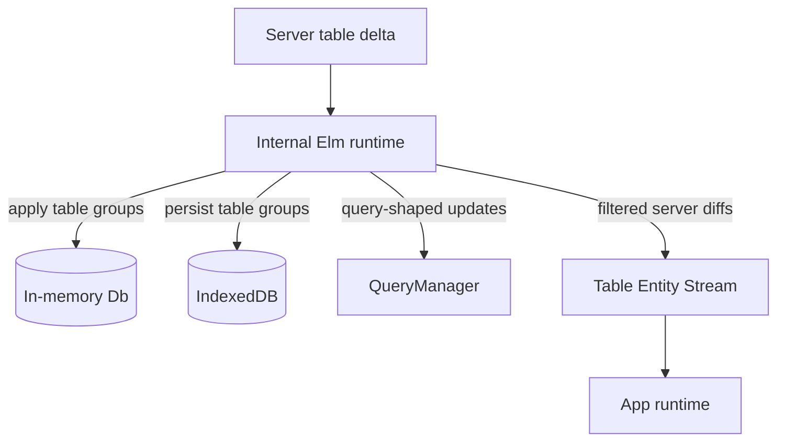

# Table Entity Stream Spec

Status: draft proposal.

Pyre currently exposes live query results through QueryManager. This spec proposes a lower-level sibling API: subscribe directly to incoming server table diffs from selected tables, optionally filtered by a condition.

This must be consumable from both TypeScript and generated Elm app code.

## Goal

Expose incoming server table diffs to app code without going through QueryManager and without adding another client cache.

The app should be able to say:

- Subscribe to all incoming rows for `posts`.
- Subscribe to incoming `posts` rows where `author_id == currentUserId`.
- Subscribe to incoming `comments` rows where `post_id` is in a set the app cares about.
- Feed those row changes into an app-owned derived-data runtime.
- Do the same from TypeScript or from generated Elm APIs.

## Non-Goals

- Replace live queries.
- Produce nested result trees, joins, sorting, or limits.
- Add a new server wire format in the first version.
- Maintain another cache just to calculate membership diffs.
- Guarantee insert versus update, field-level diffs, deletes, or previous values.

## Current Flow



The entity stream branches from the same server table delta that the internal DB applies. It filters and reshapes that delta; it does not own durable state.

## What Diffs Do We Have?

Current client deltas are grouped current-row payloads:

```ts
type ServerTableDelta = Array<{
  table_name: string
  headers: string[]
  rows: unknown[][]
}>
```

From this incoming server delta, the client can reliably derive:

- table name
- row ID, assuming an `id` column
- current row value
- that this row appeared in an incoming diff

The client cannot reliably derive without extra state or a richer server delta:

- whether the row was an insert versus update
- which fields changed
- deleted rows
- previous row values
- that a row used to match a condition and no longer does

So the first stream shape should use `row`, not separate `insert`, `update`, `left`, or `delete` operations:

```ts
type EntityChange = {
  tableName: string
  id: string | number
  op: "row"
  row: Record<string, unknown>
}
```

## Subscription Contract

The app subscribes to one or more table streams. This is the common contract behind both the TypeScript and generated Elm APIs:

```ts
type EntitySubscription = {
  tables: EntityTableSubscription[]
}

type EntityTableSubscription = {
  tableName: string
  where?: EntityWhere
}
```

The stream emits batches of matching incoming rows:

```ts
type EntityChangeBatch = {
  type: "entity-change-batch"
  databaseId?: string
  sequence: number
  source: "indexeddb-initial" | "catchup" | "live"
  changes: EntityChange[]
}
```

`sequence` is monotonically increasing per internal database client. It preserves the order in which Pyre observed incoming diffs.

## TypeScript API

TypeScript consumers subscribe through `PyreClient`:

```ts
const unsubscribe = await client.onEntityChanges(
  "main",
  {
    tables: [
      { tableName: "posts", where: { author_id: currentUserId } },
      { tableName: "comments", where: { post_id: { $in: visiblePostIds } } },
    ],
  },
  (batch) => loreRuntime.apply(batch.changes)
)
```

The first callback is always an initial IndexedDB batch for the subscribed tables and conditions. If no persisted rows match, the initial batch has an empty `changes` array. Incoming catchup or live deltas that arrive while the initial snapshot is loading are delivered after the initial batch.

If the app needs to change conditions, it should unsubscribe and resubscribe with the new subscription.

The callback receives raw row objects:

```ts
type EntityChange = {
  tableName: string
  id: string | number
  op: "row"
  row: Record<string, unknown>
}
```

## Generated Elm API

Generated Elm should expose typed table-stream constructors in the same spirit as generated query constructors.

Sketch:

```elm
type EntitySubscription
    = Posts PostsWhere
    | Comments CommentsWhere


type alias PostsWhere =
    { authorId : Maybe (Db.Id.User)
    }


type alias CommentsWhere =
    { postId : Maybe (List Db.Id.Post)
    }
```

The generated app-facing module should let the app register subscriptions by ID:

```elm
type EntityStream
    = EntityStream DatabaseId StreamId (List EntitySubscription)


type Msg
    = EntityStreamUpdate EntityStream
    | EntityChangesReceived StreamId EntityChangeBatch
```

The generated module serializes subscriptions into the common port shape:

```json
{
  "type": "register-entity-stream",
  "databaseId": "main",
  "streamId": "visible-posts",
  "tables": [
    { "tableName": "posts", "where": { "author_id": 1 } }
  ]
}
```

Returned changes should decode to typed variants when possible:

```elm
type EntityChange
    = PostRow Db.Post
    | CommentRow Db.Comment
    | EntityDecodeFailed String Decode.Value
```

The generated Elm code does not need to store entity stream data. It only needs to register streams, decode batches, and route typed row events to the app. The consuming app owns any storage or derived data structures.

## Conditions

Conditions are evaluated locally against each row in the incoming server diff after Pyre expands the table group. They are not joins.

Recommended first condition shape:

```ts
type EntityWhere = Record<string, EntityWhereValue>

type EntityWhereValue =
  | string
  | number
  | boolean
  | null
  | { $eq: unknown }
  | { $ne: unknown }
  | { $in: unknown[] }
  | { $nin: unknown[] }
```

Examples:

```ts
client.onEntityChanges(
  { tables: [{ tableName: "posts" }] },
  (batch) => loreRuntime.apply(batch.changes)
)
```

```ts
client.onEntityChanges(
  { tables: [{ tableName: "posts", where: { author_id: currentUserId } }] },
  (batch) => loreRuntime.apply(batch.changes)
)
```

```ts
client.onEntityChanges(
  { tables: [{ tableName: "comments", where: { post_id: { $in: visiblePostIds } } }] },
  (batch) => loreRuntime.apply(batch.changes)
)
```

The first version treats conditions as client-side filters only. They do not reduce what the server syncs unless a future server-side table subscription protocol is added.

## Condition Semantics

Because v1 does not maintain another cache or compare against previous rows, conditions answer:

> Does this incoming row match this condition now?

That means v1 emits rows that appear in the incoming diff and match now. It does not emit `left` events for rows that used to match and now no longer match.

Example:

```ts
// Subscription
{ tableName: "posts", where: { author_id: 1 } }

// Incoming row
{ id: 10, author_id: 2, title: "Moved" }
```

No event is emitted, even if row `10` previously had `author_id: 1` in the app's state.

Consumers that need membership removals can subscribe more broadly and decide in app state, or use a future membership-diff mode.

## Recommended First Version

1. Add TypeScript `client.onEntityChanges(subscription, callback)`.
2. Add generated Elm APIs for registering table streams and decoding typed row variants.
3. Support table-name filtering.
4. Support simple local `where` filters on incoming row values.
5. Emit matching incoming rows only.
6. Do not maintain an extra entity cache for this stream.
7. Keep QueryManager unchanged.

## Open Questions

1. Should IndexedDB initial data emit snapshot batches for matching subscriptions, or should v1 only stream new server diffs?
2. Do we ever need a membership-diff mode, and if so should it be app-owned or Pyre-owned?
3. Should generated Elm produce strongly typed `Where` records per table, or expose a lower-level condition builder?
4. Should generated Elm keep any per-stream state, or only route batches by `streamId`?
5. What explicit delete shape should be added to server deltas?
6. Should conditions reuse the existing query `@where` shape exactly, or use a smaller entity-stream condition shape?
